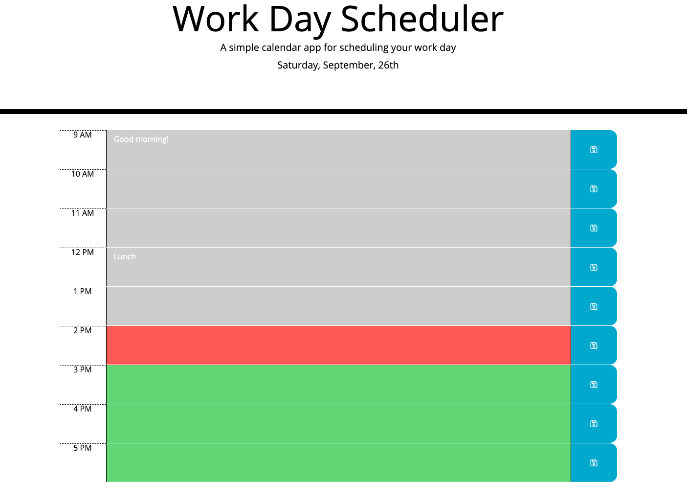

# Day Planner

## Summary
The Day Planner allows users with busy schedules to efficiently manage their time. It provides a snapshot of a daily schedule and dynamically updates to reflect the current date and time. The day and date are displayed at the top of the calendar. Standard business hours are color coded to note the past, present, and future hours of the day. Events can also be entered and saved to a user's local storage. 

## Features
* Moment.js library validates and formats the current date and time
    * The current day and date at the top of the planner utilize Moment.js
    * The coloring of the timeblocks also utilizes Moment.js to reflect the current hour as well as past and future hours

* The jQuery library dynamically manipulates HTML and CSS and also creates event handlers
    * For each timeblock hour, it creates a new element, dynamically manipulates it based on the current time, and then appends it to the page
    * It also creates an on click event handler for the save button

* Local storage stores user data in the browser
    * Users' saved events are stored in the browser's local storage so they may be accessed after refreshing the page

## Built With
* [Moment.js](https://momentjs.com/) - validates and formats the current date and time
* [jQuery](https://jquery.com/) - creates the dynamic features of the page in tandem with JavaScript
* [JavaScript](https://www.javascript.com/) - creates the dynamic features of the page
* [Bootstrap](https://getbootstrap.com/) - creates the mobile responsive layout
* [HTML](https://developer.mozilla.org/en-US/docs/Web/HTML) - creates the structure of the page
* [CSS](https://developer.mozilla.org/en-US/docs/Web/CSS) - styles HTML elements on the page
* [Git](https://git-scm.com/) - version control system to track changes in source code
* [GitHub](https://github.com/) - hosts repository and deploys page on GitHub

## Code
The below code illustrates how jQuery dynamically updates HTML and CSS to render the timeblocks for each hour. It also demonstrates how local storage and Moment.js are referenced.

    function renderTimeBlocks(){
        const currentHour = moment().hour();
        for (let hour = startHour; hour <= endHour; hour++) {
            const hourStr = (hour % 12 || 12) + " " + (hour < 12 ? "AM" : "PM");
            const timeBlock = $(`
`);
            const textArea = $(`<textarea class="col-10 text-wrap description">`);
            if (hour < currentHour) {
                textArea.addClass("past");
            } else if (hour > currentHour) {
                textArea.addClass("future");
            } else {
                textArea.addClass("present");
            }
            textArea.val(localStorage.getItem(hour) || "");
            const saveBtn = $(
                `

                    <i class="far fa-save"></i>
                
`
            );
            saveBtn.on("click", function(event) {
                event.preventDefault();
                localStorage.setItem(hour, textArea.val());
            });

            timeBlock.append(
                `${hourStr}`,
                textArea,
                saveBtn
            )
            $("#time-blocks").append(timeBlock);
        }
    }

## Deployed Link
[Day Planner](https://engrebecca.github.io/day-planner/)

## Site Picture

## Author
* Rebecca Eng
* [GitHub](https://github.com/engrebecca)
* [LinkedIn](https://www.linkedin.com/in/engrebecca/)

## Credits & Acknowledgements
Thanks to my tutor, Wesley, for teaching me a few new concepts which allowed me to create more concise and elegant code.
* The save button icon [Font Awesome](https://fontawesome.com/icons/save?style=regular)
* Documentation for short-circuit evaluation [Code Burst](https://codeburst.io/javascript-what-is-short-circuit-evaluation-ff22b2f5608c)
* Documentation for modulo operator [Free Codecamp](https://www.freecodecamp.org/news/the-python-modulo-operator-what-does-the-symbol-mean-in-python-solved/)
* Documentation for conditional operator [Mozilla](https://developer.mozilla.org/en-US/docs/Web/JavaScript/Reference/Operators/Conditional_Operator)
* Documentation for template strings [CSS Tricks](https://css-tricks.com/template-literals/)

## License
This project is licensed under the MIT license